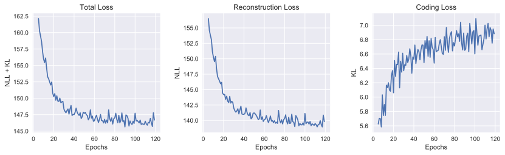
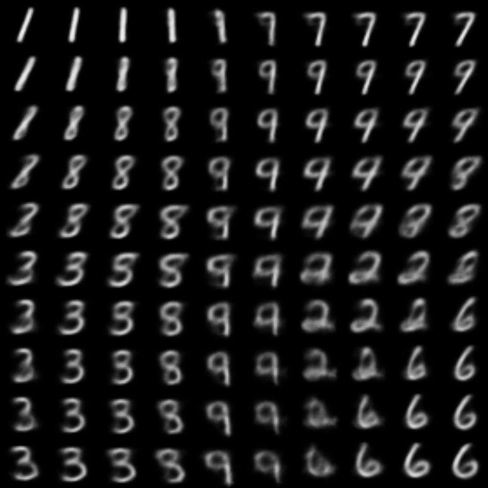

## VAE on MNIST

### Interactive Manifold Visualization

[https://mshakerinava.github.io/vae-lib/examples/mnist/web/](https://mshakerinava.github.io/vae-lib/examples/mnist/web/)

### Learning Plots

### 2D Latent Manifold

